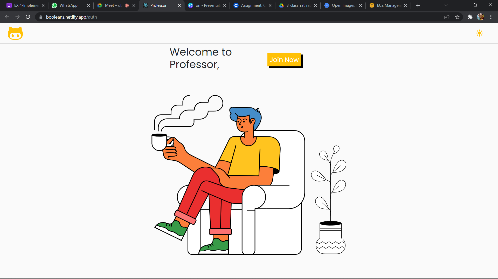

# [SCHOOLOGY](https://booleans.netlify.app/)
# Submission by Team !Booleans for Hack BMU 5.0
Entry of !Booleans, from SRM Institute of Science and Technology, Kattankulathur, to Hack BMU 5.0.

Open Innovation: An open-ended theme where the only restriction is your imagination. Build the ideas that you believe in and make a difference. It can either be hardware or software.
Our Approach : We decided to come up with a Solution which makes the lives of students and teachers easy by availing them online schooling platform which provides various features in it.

<h2 align= "left"><b>Our Product</b></h2>

We !Booleans present before you,<b>"SCHOOLOGY"</b>. We will be e helping students to grow there minds and learn online, teachers in maintaining student assignments and grading them, also taking care of young minds who are not able to go to school , we have a solution for all of them.

  
<h2 align= "left"><b>Website in a Print view</b></h2>

 &ensp;
 &ensp;
 &ensp;
 &ensp;  

  

  
<h2 align= "left"><b>Product as a Moblie Application</b></h2>

 &ensp;
 &ensp;
 &ensp;
 &ensp;

 
 

## Presentation
[PPT](https://www.canva.com/design/DAE4uj4iMtI/Cd1rZ3DQ_mwPQphD7C7nlw/edit)

## Tech Stack

- eJS,CSS,Bootstrap

- React JS

- Webkit Speech recognition API
  
- Python, Docker , AWS

- Firebase Storage.
  
- Flutter for App . 

<h2 align= "left"><b>Our Product can be viewed at:-</b></h2>

- Website Link : 
- Youtube Demo : 

